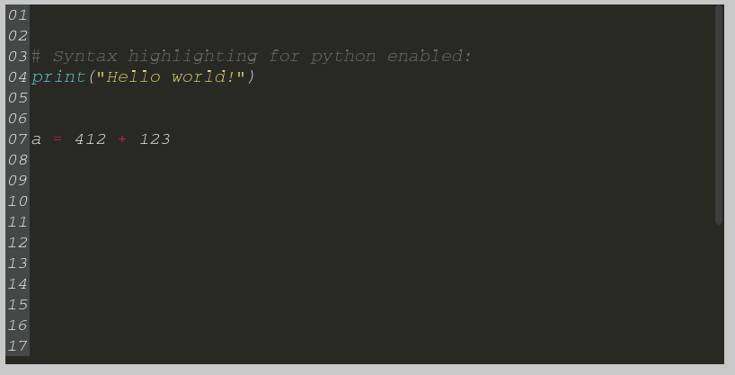
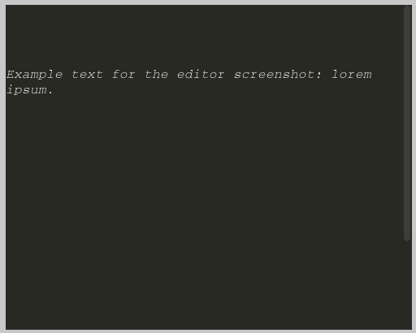

# A WYSIWYG-texteditor based on pygame for pygame


## Introduction & examples

The text editor can be inserted into any existing pygame window.
A minimal code example of it being activated within an existing pygame window can be found below.

The code editor comes with line numbers and syntax highlighting for python if enabled:



Example with default configuration:



## Usage

The texteditor takes 5 obligatory parameters and 4 optional parameters.

##### Obligatory parameters
- ```offset_X``` : integer - the offset from the left border of the pygame screen
- ```offset_y``` : integer - the offset from the top border of the pygame screen
- ```editor_width``` : integer - the width of texteditor
- ```editor_height``` : integer - the height of texteditor
- ```screen``` : pygame display surface - on which the texteditor is to be displayed

##### Optional Parameters with default values

- ```display_line_numbers``` - a boolean enabling showing line numbers
    > Default: ```False```
- ```style``` - a String setting the color scheme of editor and syntax highlighting
    > Default: ```'dark'```
- ```syntax_highlighting_python``` - a boolean enabling syntax highlighting for Python code
    > Default: ```False```
- ```font_size``` - an integer to set for the font size.
    > Default: ```16```

## Setup and configuration

##### Minimal texteditor setup example

```python
import pygame
from pygame_texteditor import TextEditor

# minimal pygame setup
pygame.init()
screen = pygame.display.set_mode((500, 600))
pygame.display.set_caption("Pygame")
pygame.display.get_surface().fill((200, 200, 200))  # background coloring

# Instantiation & customization of the text editor
TX = TextEditor(
    offset_x=50, offset_y=50, editor_width=500, editor_height=400, screen=pygame.display.get_surface()
)
TX.set_line_numbers(True)
TX.set_syntax_highlighting(True)
TX.set_font_size(18)

# TextEditor in the pygame-loop
while True:
    # INPUT - Mouse + Keyboard
    pygame_events = pygame.event.get()
    pressed_keys = pygame.key.get_pressed()
    mouse_x, mouse_y = pygame.mouse.get_pos()
    mouse_pressed = pygame.mouse.get_pressed()

    # displays editor functionality once per loop
    TX.display_editor(pygame_events, pressed_keys, mouse_x, mouse_y, mouse_pressed)
    pygame.display.flip()  # updates pygame window

```

##### Retrieving text from the editor

The editor offers the function `get_text_as_string()` to retrieve the entire text
as a String from the editor. Lines are separated by the new line character ```\n```.

The editor offers the function `get_text_as_list()` to retrieve the entire text as a list from the editor.
Each String-item in the list represents one line from the editor.

##### Removing text from the editor

The editor offers the function `clear_text()` to clear the editor of any text.

##### Inserting text into the editor

Inserting text can be done by using one of the two available functions:
1. With a list of strings in which each string represents one line, or
2. With a string which includes linebreak characters which get parsed.

```
set_text_from_list(["First line", "Second Line.", "Third Line."]
set_text_from_string("First line.\nSecond line.\nThird Line")
```

## Customization

#### Cursor mode

Cursor mode can either be `static` or `blinking` (=default).

```python
TX = TextEditor(...)
TX.set_cursor_mode("static")
TX.set_cursor_mode("blinking")
```

#### Key repetition speeds

While a key is being held, multiple key events are being triggered.
The delay of the first repetition as well as the interval between all sequential key triggers can be
customized by using the function `set_key_repetition(delay=300, intervall=30)`.

From the [official documentation](http://www.pygame.org/docs/ref/key.html#pygame.key.set_repeat):
> The delay parameter is the number of milliseconds before the first repeated pygame.KEYDOWN event will be sent.
> After that, another pygame.KEYDOWN event will be sent every interval milliseconds.


#### Font Customization

The editor uses a ttf file to set the font for the editor. By default, the Courier monospace font is used.

A custom font can be loaded with the following method, passing an *absolute* path:
- `set_font_from_ttf("X:\path\to\custom\font.ttf")`

DISCLAIMER: As the width of a letter (space) is only calculated once after setting the font_size, any fonts that are not monospace will lead to the editor not working correctly anymore, as it cannot be determined correctly between which letters the user clicked.

#### Font size

Font size can be customized with the command `set_font_size(size)` - the parameter is an integer
with the default value `16` to be able to reset it.

#### Line Numbers
Line numbers can be shown on the left side of the editor. Line numbers begin with 0 as is the Pythonian way.

Line numbers can be enabled and disabled with ```set_line_numbers(Boolean)```.


#### Syntax Highlighting

The editor comes with syntax highlighting for Python code. Tokenization is based on the ```pygment``` package.

Syntax highlighting can be enabled/disabled with ```set_syntax_coloring(boolean_value)```.

The syntax colors being used are also specified in the yml style file.


#### Color-scheme customization

The editor uses a yml file to set the color-scheme for the editor itself and for the syntax coloring.

Two styles are delivered with the editor, they can be activated respectively by:
- `set_colorscheme("dark")`
- `set_colorscheme("bright")`

A custom style can be loaded with the following method from a created yml file:
- `set_colorscheme_from_yaml("X:\path\to\custom\filename.yml")`

All keys must be present with values. Acceptable values are
RGB colors in the following format: ```(255, 255, 255)``` or ```255, 255, 255```.

The following keys are required in the ```stylename.yml``` file, syntax colors are only used if syntax
highlighting is enabled, but are still required to be included.

**Editor colors** (source: bright.yml)

- `codingBackgroundColor: (255, 255, 255)`
- `codingScrollBarBackgroundColor: (49, 50, 50)`
- `lineNumberColor: (255, 255, 255)`
- `lineNumberBackgroundColor: (60, 61, 61)`
- `textColor: (255, 255, 255)`

** Syntax colors** (source: bright.yml)

- `textColor_normal: (0, 255, 255)`
- `textColor_comments: (119, 115, 115)`
- `textColor_quotes: (227, 215, 115)`
- `textColor_operators: (237, 36, 36)`
- `textColor_keywords: (237, 36, 36)`
- `textColor_function: (50, 150, 36)`
- `textColor_builtin: (50, 50, 136)`
